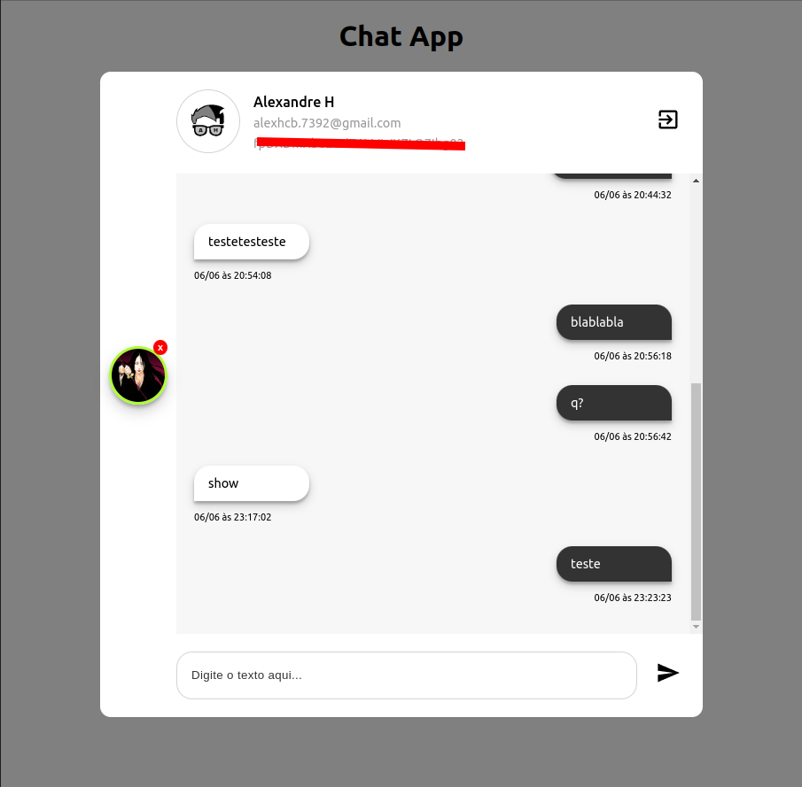

# A simple chat application with React/Typescript and Firebase Auth/Database

This project was bootstrapped with [Create React App](https://github.com/facebook/create-react-app).




## Get started

Before installing on your local machine, go create an account on [Firebase](https://firebase.google.com), after you've created an account, click the create project, then enter the project name, see example below


Follow the next step, and after you've created your project in Firebase, you'll see something like this


hit the `</>` button and register your app, enter the name, and click register app, after that, copy the **_entire object key and value_** in the `firebaseConfig` constant, see picture below


## Installing on your local maching

Clone this repo

```bash
git clone https://github.com/ayusuke7/ChatApp .
```

Install all the packages

```bash
npm install
```

after you've copied the firebase config object, create a `.env` file in the root of this project, copy the variable in `.env.example` file and paste it in `.env` file along with your firebase config, and you're ready.

```env
REACT_APP_APIKEY=<apiKey>
REACT_APP_AUTHDOMAIN=<authDomain>
REACT_APP_DATABASE_URL=<databaseUrl>
REACT_APP_PROJECT_IT=<projectId>
REACT_APP_STORAGE_BUCKET=<storageBucket>
REACT_APP_MESSAGING_SENDER_ID=<senderId>
REACT_APP_APP_ID=<appId>
REACT_APP_MEASUREMENT_ID=<measurementId>
REACT_APP_ADM_EMAIL=<adm_email>
```

## Rules Firebase Database

```json {
  "rules": {
    "chats": {
      ".read": true,
      "$userId": {
        ".write": "$userId === auth.uid || auth.token.email === '<admin_email>'"
      }
    }
  }
```
